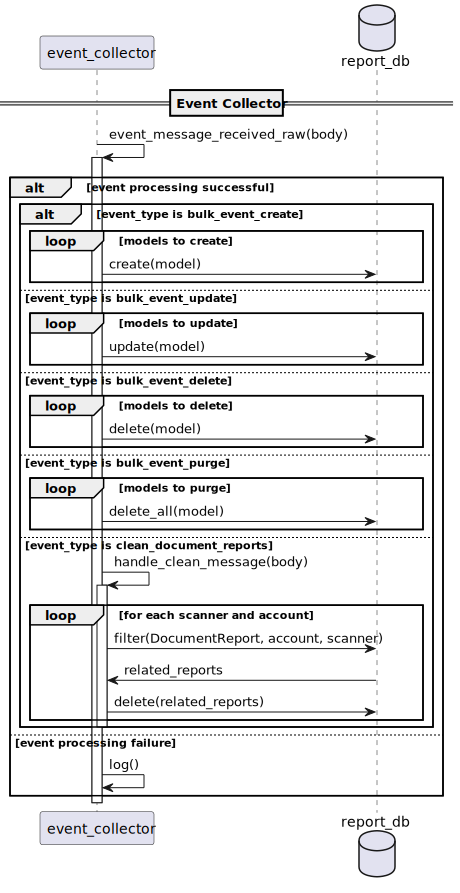

# Pipeline architecture

The `os2datascanner.engine2.pipeline` module contains the `engine2` pipeline,
also known as the _scanner engine_.

## What components make up the pipeline?

The pipeline implementation consists of five stages:

* the Explorer, which consumes a *source* message, explores all of the objects
  in that source, and produces potentially many *conversion* or *problem*
  messages;
* the Processor, which consumes a *conversion* message, converts an object into
  the appropriate form for a rule to be applied to it, and produces precisely
  one *representation* message, *problem* message, or *source* message;
* the Matcher, which consumes a *representation* message, attempts to match a
  rule against a representation of an object, and produces potentially many
  *match* messages and at most one *handle* message;
* the Tagger, which consumes a *handle* message, extracts useful metadata from
  the object that it references, and produces a *metadata* message; and
* the Exporter, which consumes *match*, *problem* and *metadata* messages and
  produces *result* messages suitable for the outside world.

To improve cache efficiency, and to reduce the amount of potentially sensitive
information transmitted over the underlying RabbitMQ message bus, the
Processor, Matcher and Tagger stages are customarily bundled into a single
process known as the _worker_.

## Components supporting the pipeline operation

In addition to the five stages mentioned above, there are also four _collectors_,
which update the databases for the admin and report modules with relevant information
about the running scanner jobs. While these _collectors_ are not technically a part of
the pipeline, they provide important information about the state of the running scanner
jobs across the admin and report modules:

* Checkup Collector (admin): This collects *checkup* messages about objects that should be
  revisited (scanned again) next time the scanner jobs runs.
* Status Collector (admin): This collects *status* messages about the current status of a
  scanner job, i.e. the number of objects scanned so far, the total number of objects,
  the number of explored sources, etc.
* Event Collector (report): This collector maintains `Organisation`s, `OrganizationalUnit`,
  `Account`, `Alias` and `Position` objects in the report module database, such as 
  bulk CRUD operations on said objects.
* Result Collector (report): This collects *problem*, *metadata* and *match* messages and
  is in charge of performing CRUD operations for `DocumentReport`s in the report module
  database.

## What are the pipeline's design principles?

* Simple external interfaces

  The pipeline should expose a clear API for getting instructions into the
  pipeline and results out of it; interacting with the pipeline in any other
  way should not be supported.

* Always in motion

  The pipeline (as a whole) should never wait. Individual instances of stages
  might wait for any number of reasons, but they shouldn't slow down the rest
  of the pipeline.

* High tolerance

  Provided that an AMQP message contains valid JSON, a stage should accept it
  immediately. Problems with handling the message should be presented as
  *problem* messages rather than raising an exception.

* Unambiguous results

  It should be possible, from the output of the pipeline, to distinguish
  between an object that didn't match a rule and an object that hasn't been
  examined yet. Objects in transit through the pipeline shouldn't just
  disappear.

* Trivial stage implementations

  Stages should be short and readable and should perform a single simple task.
  For example, the Tagger was added as a separate stage instead of giving the
  Matcher responsibility for metadata extraction.

* No unnecessary work

  Objects should skip over pipeline stages as soon as it's clear that it's
  possible.

* Clear security boundaries

  As many stages will be dealing with privileged authentication details and
  sensitive information, each stage should have clear security boundaries. To
  the extent that this is possible, a stage should be capable of being run as
  an unprivileged user with no network access in a read-only filesystem.

  Adding a new stage should be preferred to extending the security boundaries
  of an existing stage; this was another reason why Tagger, which requires
  access to content and metadata, was added instead of extending Matcher,
  which requires neither of these things.

* State is bad

  Stages should read JSON-formatted messages from AMQP queues, perform some
  appropriate work, and then write JSON-formatted messages to AMQP queues. No
  stage should maintain any internal (apart from trivial caching) or external
  state.

  In particular, this means that pipeline stages should not communicate with a
  database: their tasks should be precisely and exclusively specified by their
  input.

## The big picture - communication between OS2datascanner components

As mentioned, the engine consists of five stages that work in tandem with the
four collector processes and the admin and report module. There are a lot of complex,
moving parts.

To ease comprehension of the entire set of interactions at a fine level of detail, 
an overview of interactions between all components (as well as the user) is illustrated by
the UML Sequence Diagram below:

_Note: Due to the distributed nature of the system, all of the messages should be
considered asynchronous._

This diagram is divided into sections: one for each of the engine pipeline stages,
one for the collector processes with subsections, as well as two sections that briefly
describe startup and completion of a scanner job, respectively.

It illustrates the interaction of the components, but as is evident, RabbitMQ is the mediator
that enables communication between them. For a detailed description of the use of RabbitMQ
and AMQP, please see the section on [RabbitMQ](./rabbitmq.md).

As stated this is a broad overview. Detailed diagrams of the individual component are
presented in the following subsections.

### Explorer

The first stage of the pipeline is the explorer which starts out by consuming
a `ScanSpecMessage` from RabbitMQ. This message contains a specification for the
scanner jobs with the type of the data source that needs to be scanned.

Then all scannable content from a source is fetched. Depending on whether the
content is a "nested source" (i.e. contains other content, like a directory) then
a new `ScanSpecMessage` with the "nested source" is enqueued in RabbitMQ or
a `ConversionMessage` with the content is enqueued and sent to the worker.
Should a conversion fail, a `ProblemMessage` is enqueued.

Finally, no matter the outcome of the above, a `StatusMessage` describing
the progression of the scanner job is enqueued and sent to the status collector.

### Worker

The worker used to be four separate stages and as such is quite a bit more
complicated than the other stages. To reduce the traffic and workload on RabbitMQ,
these four stages were combined into a single unit to eliminate any unnecessary
messages. That is, enqueueing messages to RabbitMQ may be bypassed if the target
stage is a substage of the worker process, so not all messages actually go through
the message broker. As such, words like "enqueued" and "consumed" should be interpreted
as maybe for all substages of the worker stage.

#### Processor

The processor is in charge of converting whatever incoming data to a format that the
remaining stages of the engine can work with, which is typically in the form of text.

For each type of content there is an appropriate conversion to a desired output format
which is run on that content. If the conversion yields a new "nested source" then a 
`ScanSpecmessage` which is sent to the explorer. Otherwise if the conversion yields a
desired output format, then a `RepresentationMessage` is passed to the matcher.
If the conversion fails, two things happen: a `ProblemMessage` is emitted and a
`CheckupMessage` is sent to the checkup collector, so that the content can be revisited
some time in the future.

#### Explorer

This is an internalised clone of the explorer stage from earlier and does essentially the same thing, except that `ScanSpecMessage`s are rerouted to itself instead of utilizing RabbitMQ.

#### Matcher

Once the content has been converted into a workable representation by the processor, the actual
scanning can take place. This is the responsibility of the matcher.

First, a `RepresentationMessage` is consumed, which contains a scannable representation of the
content, that the matcher can then apply an accompaning `Rule` to it until a conclusion is reached..
Once a conclusion is reached, a `MatchesMessage` is enqueued and sent to the exporter,
a `HandlesMessage` is sent to the tagger and a `CheckupMessage` is sent to the checkup collector.

However, the matcher may not be able to reach a conclusion either because it encountered
an error, in which case both a `ProblemMessage` and a `CheckupMessage` is emitted, or
because the current representation might need further conversion.

#### Tagger

The tagger is responsible for extracting relevant metadata about the scanned content
to be presented to the user. 

Upon receiving a `HandlesMessage`, the tagger applies the appropriate handler to extract
the relevant metadata from the content and enqueues a `MetadataMessage` that is sent to
the exporter.

Of cause, the extraction might fail in which case a `ProblemMessage` is enqueued in RabbitMQ.

### Exporter

The exporter is the final stage of the pipeline before the data leaves the engine.
Inside the engine space, everything is processed in memory, which means that no trails of sensitive
information or even breadcrumbs thereof is left behind. 

However, outside the engine results from a scanner job needs persistent storage for future 
presentation to the user. If a result contains a match involving sensitive information, 
this information would then be stored persistently in disk, where it might be vulnerable if 
forgotten and left behind.

The job of the exporter is to compile `MetadataMessage`s, `MatchesMessage`s and `ProblemMessage`s
into a uniform `ResultMessage`s, which are censored in case of matches involving sensitive information.

### Checkup Collector

Sometimes, some of the content to be scanned is not available, errors occur while processing
it or the content matches against one of the applied rules. In any case, the scanning 
of the content resulted in some kind of state that warrents revisiting it in the future
to scan it again and see if said state has changed.

This concept is called a checkup. Once a worker determines that a checkup is required for
some content, it emits a `CheckupMessage` which is then consumed by this stage, the checkup
collector.

The consumed `CheckupMessage` is then converted to a database object and stored in the
admin modules database. The next time that the scanner job is started, every relevant
checkup message is enqueued in the pipeline along with the regular `ScanSpecMessage`s. 

### Status Collector

Due to its distributed nature, it can be difficult for the user to keep up with what is
happening during the execution of a scanner job. To keep the user informed, the various
stages emit a `StatusMessage` with the latest state of the scanner job.

The responsibility of the status collector is to consume these messages from RabbitMQ
and perform CRUD operations on a corresponding database object in the admin module. 
This database object is then queried by the admin module and presented to the user.

### Event Collector

This collector handles bulk CRUD operations on various objects in the report module
database.

### Result Collector

Once the exporter stage has emitted a `ResultMessage`, the result collector listens
for and consumes these messages with the purpose of performing CRUD operations on
`DocumentReport` objects in the report module database. A `DocumentReport` represents
scanned content and contains relevant metadata and either matches or a problem description
in case of an error.

## The basis of a pipeline stage instance

Since every pipeline stage must communicate with RabbitMQ using AMQP and must be run
concurrently on separate threads, all engine stages share some common abstractions
depicted on the UML Class Diagram below:

There are four classes in this class hierarchy, three of which that provide some general 
interactions with RabbitMQ:

- `PikaConnectionHolder`
- `PikaPipelineRunner`
- `PikaPipelineThread`

The `GenericRunner` handles messages that are specific to the OS2datascanner engine.

_Note: all of the four collector processes have their own specialized runner based
on `PikaPipelineThread` instead of using the `GenericRunner`._

Together, these three abstractions allows one to create a separate thread for some routine
that involves communication with an AMQP message broker. Let's us examine each one in detail:

### `PikaConnectionHolder`

This class is responsible for establishing and maintaining a blocking connection with an AMQP broker
with parameters defined in `os2datascanner/utils/pika_settings.py`.
These parameters include host, port, virtual_host, heartbeat and authentication with credentials
among others.

It can also create an AMQP channel and automatically takes care of any required cleanup upon object
destruction. In other words, if we consider AMQP connections and channels to be resources,
`PikaConnectionHolder` implements [RAII](https://en.wikipedia.org/wiki/Resource_acquisition_is_initialization) for said resources.

Although not an abstract class, `PikaConnectionHolder` is never instantiated in practice (except
for testing purposes and some cli utilities), but serves as a base for inheritance.

### `PikaPipelineRunner`

This class extends `PikaConnectionHolder` with AMQP exchange and queue declarations as well as
wrapper methods for basic AMQP messages such as acknowledgement, consumption and cancellation.

Like `PikaConnectionHolder`, `PikaPipelineRunner` is also never instantiated in practice.

### `PikaPipelineThread`

This class implements `threading.Thread` as well as extending `PikaPipelineRunner`. 
It runs two threads: a main thread (`run_consumer()`) and a background thread (`run()`).

The background thread runs an event-loop that reads from a local message buffer 
(`self._outgoing`) and dispatches these to RabbitMQ depending on the message head.

The main thread runs another event-loop that reads from a local message buffer
(`self._incoming`), which contains the read queues. It produces messages for the background
thread using the `handle_message()`-method.

This class is used not only by the pipeline stages, but also by the admin module to initiate
scanner jobs in the first place.

The interaction between the main thread, the background thread and RabbitMQ is captured by the UML
Sequence Diagram below:

