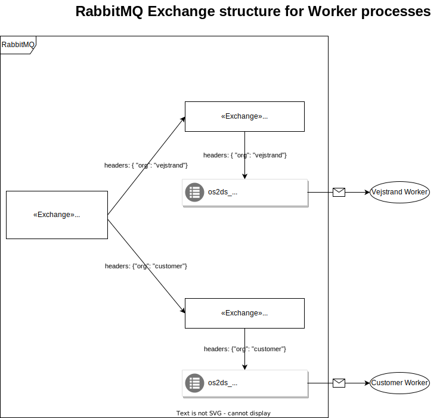

# RabbitMQ in OS2datascanner

In order to obtain a distributed system, where the admin module, the report module
and the engine components can run concurrently on separate machines that are
part of a network, [RabbitMQ](https://www.rabbitmq.com) (with [AMQP](https://www.amqp.org/) version 0.9.1)
is used as the primary medium of communication between said modules/components.

## Use of AMQP exchanges in RabbitMQ

To provide a scalable concurrent engine that can serve multiple users (organisations) on same
instance, a special routing strategy is required, which involves the use of AMQP headers-exchanges.

Recall the _worker_ stage from the engine pipeline, each _worker_ instance should serve a specific user
(organisation). The other engine stages, such as the _explorer_ and the _exporter_, don't serve
a specific user. Given a `ConversionMessage`, how does an _explorer_ instance know which _worker_ 
instance should receive the message? It doesn't need to:

In the diagram above, we have a "root" exchange (os2ds_root_conversions), which is in charge of redistributing messages
to customer-specific exchanges (e.g. os2ds_conversions_vejstrand and os2ds_conversions_customer for the 
organisations vejstrand and customer, respectively). The customer-specific exchange then handles distribution to either 
a general conversions queue with the same name as the exchange (os2ds_conversions_<<organisation_name>>, 
e.g. os2ds_conversions_vejstrand) or a specialized queue for handling specific messages based on
source/mime type with the name os2ds_conversions_<<organisation_name>>_<<mime_type_name>> (doesn't appear on the diagram).

When sending a `ConversionMessage`, the `name` of the organisation that the scanner job belongs to
is extracted from the message and used as a header, e.g. `{"org": "Vejstrand"}`. Based on this,
the "root" exchange will route the message to the exchange belonging to the organisation, which
will in turn enqueue it to the appropriate message queue.

There is only one problem, though. The concept of organisations belong to the admin and report modules,
which the engine is unaware of. As such, when talking about "organisations" in the context of the
engine pipeline, we are only interested in the name of the organisation, which we call the `queue_suffix`.
The `queue_suffix` is simply a string that will be appended to name of the customer-specific exchange and
the corresponding general conversions queue (i.e. `os2ds_conversions_<<queue_suffix>>`).

### An important note about declaration of the exchange structure

As the engine pipeline components run in isolated containers, they are unaware of how many organisations
there are on the OS2datascanner instance. Similarly, the admin and report modules don't know the exchange
structure in the engine or how many _workers_ there are and who they serve.

Declaration and binding of the exchange structure and the associated queues has to be done at some point.
Since the AMQP protocol is idempotent when it comes to exchange and queue declaration, the exchanges are
declared at two points:

1. When starting a scanner job from UI in the admin module
2. Upon startup of an engine stage instance

However, the declaration and binding of queues is only handled at engine stage instance startups.
This means that, although undesirable, two scenarios are possible:

1. An organisation starts a scanner job and declares specific exchanges, but no workers and thus no queues
   have been started, resulting in a lot of _dead AMQP messages_ (RabbitMQ will probably yell at you)
   because no queues have been bound to these exchanges.
2. Workers for non-existant organisations have been provisioned, which take up system resources.

The former is probably the worse offender here.
