# Forudsætninger for scanning af Office 365 (og MSGraph/Entra ID organisatorisk import)

Guiden her viser hvordan man opretter en applikation i Azure Portal, som kan bruges til at lave
en OSdatascanner `GraphGrant` / MSGraph bevilling, der tillader import af Entra samt scanning af
O365 datakilder.

Det er også muligt at foretage organisatorisk import via andre kilder, omend er det en forudsætning at
der findes organisatorisk data i OSdatascanner for at udvælge hvem der skal dækkes af eventuelle scannerjobs.
Dette dækker denne guide ikke.

Gennem denne guide anvendes Vejstrand Kommune som eksempel. 
Udskift derfor tekster, såsom "Vejstrand" og `DIN_ORGANISATIONS_NAVN`, med
navnet på jeres organisation.

## Del 1: Opsætning af Applikation i Azure (Entra)

For at kunne scanne filer og mails fra Office 365 med **OSdatascanner**, så skal
der først registreres en Azure/Entra Applikation for at give tilladelse til at hente
data fra Office 365. Denne del af vejledningen viser, hvordan man,
trin-for-trin, registrerer en Azure Applikation.

*Step 1:* Log ind på Microsoft Azure's portal via. [https://portal.azure.com/#home](https://portal.azure.com/#home).
	Vælg nu: "Microsoft Enntra ID".

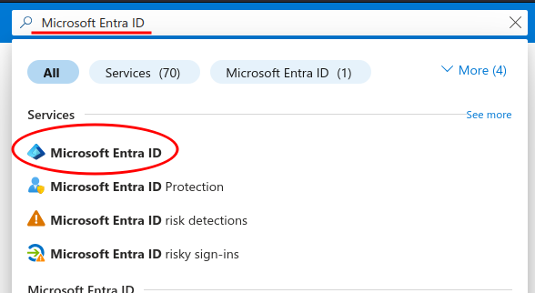

*Step 2:* Under "Manage" i menuen i venstre side skal du vælge "App
registrations".

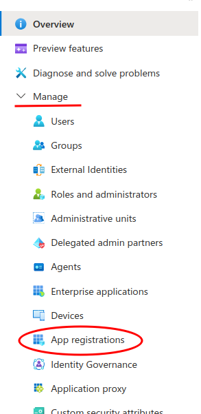

*Step 3:* Klik på "New registration".

*Step 4:* Indtast et sigende navn for applikationen i inputfeltet "Name". 
	Et sigende navn kunne eksempelvis være "OSdatascanner for `DIN_ORGANISATIONS_NAVN`".
	Vælg nu "Accounts in this organizational directory only (Single tenant)" under "Supported account types".
	Indtast følgende i inputfeltet for "Redirect URI": `https://DIN_ORGANISATIONS_NAVN-admin.os2datascanner.dk/grants/msgraph/receive/`

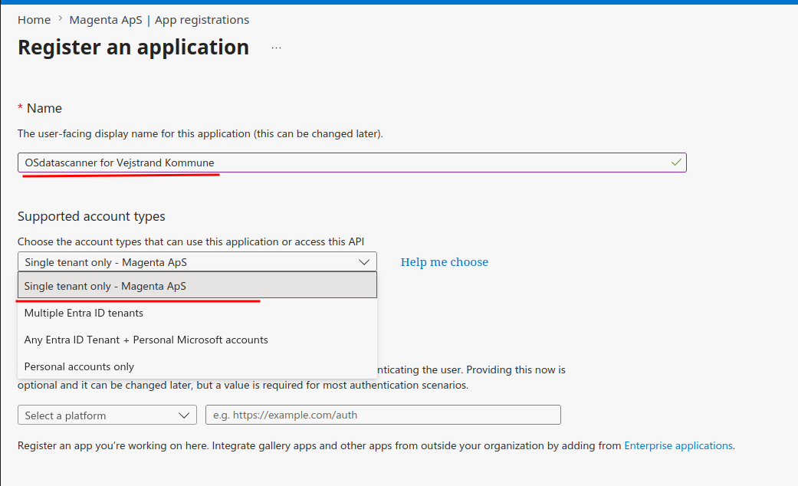

*Step 5:* Når ovenstående er udfyldt, så skal du klikke på "Register".
	Nu har du registreret en ny app, og du skulle gerne se en oversigt over den nye app:

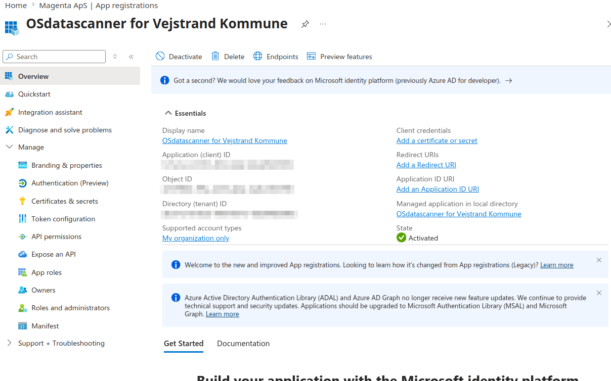

*Step 6:* Notér dig nu "Application (client) ID" og "Directory (tenant) ID, **disse skal bruges i OSdatascanner.**

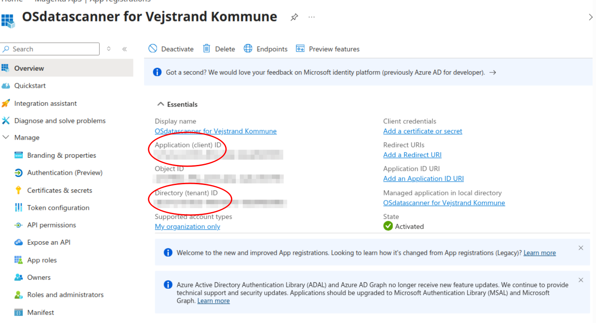

*Step 7:* For at OSdatascanner kan scanne emails og filer i Entra via den oprettede Applikation, så skal der genereres en Client secret.

Det gøres via. menupunktet "Certificates & secrets" i menuen til venstre.

Klik nu på "New client secret".

Indtast et beskrivende navn for denne "client secret" i inputfeltet "Description", og sæt en fornuftig udløbsdato.

Det anbefales, at udløbsdatoen ikke er længere fremme end 6 måneder af sikkerhedsmæssige årsager.

Klik på "Add". 

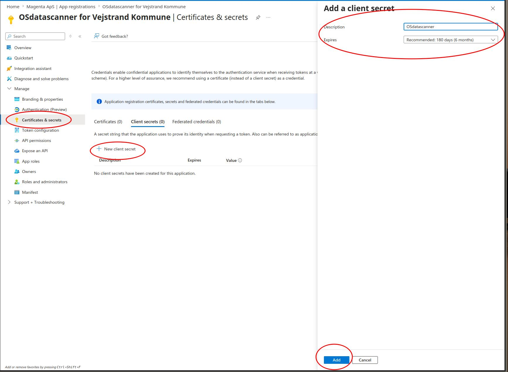

*Step 8:* Kopier nu "Value" for den genererede client secret ved at klikke på Kopier ikonet lige ved siden af.

Denne værdi kan kun ses lige efter oprettelse, så derfor er det vigtigt at værdien gemmes et sikkert sted.
Notér denne, da den skal bruges i OSdatascanner.

**OBS**: Det er meget vigtig, at denne client secret opbevares sikkert og utilgængeligt for uvedkommende.

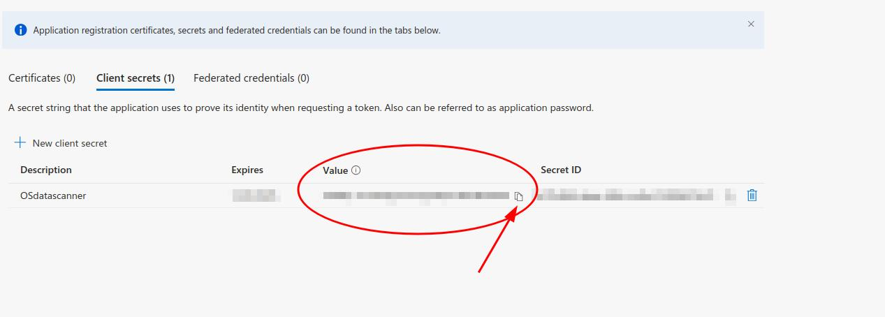

*Step 9:* Applikationen skal nu have tildelt såkaldte API rettigheder. Disse styrer præcis, hvilke data, som OSdatascanner har adgang til.
	Klik på menupunktet "API permissions" i menuen til venstre og dernæst på "Add a permission".

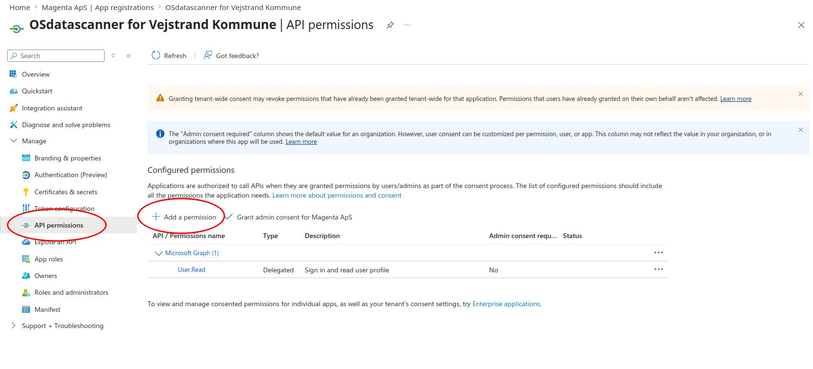

*Step 10:* Der vil nu dukke en menu op i højre side af skærmen.
	Klik på "Microsoft Graph" menuen.

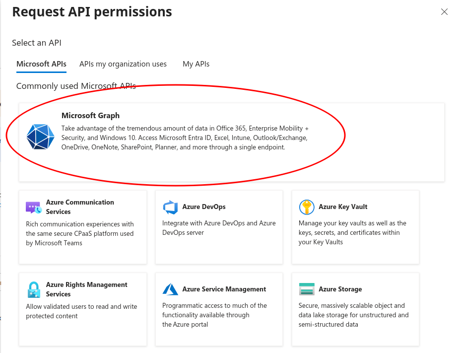

*Step 11:* Klik på menupunktet "Application permissions".

(Læg mærke til, at OSdatascanner ikke kan bruge _delegated permissions_, hvor
en tredjepartsapplikation kan handle på vegne af én bestemt bruger - systemet
skal i stedet have sin egen adgang på tværs af alle brugere.)

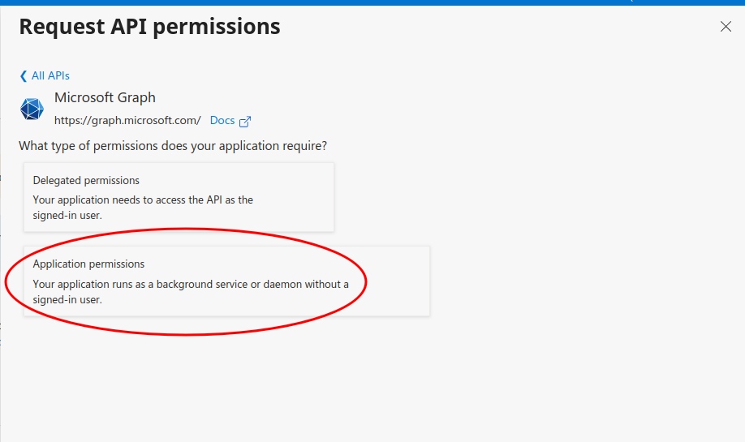

*Step 12:* Her skal der findes og tilføjes følgende permissions:

* `Directory.Read.All`
* `Files.Read.All`
* `Mail.Read`
* `Notes.Read.All`
* `Sites.Read.All`
* `User.Read`

**OBS:** Det er ikke sikkert at alle disse permissions er nødvendige, eks. kan `Mail.Read` selvfølgelig
udelades, hvis ikke der skal scannes mails.

Brug eventuelt søgefeltet, som er markeret på nedestående billede, til at søge i permissions.

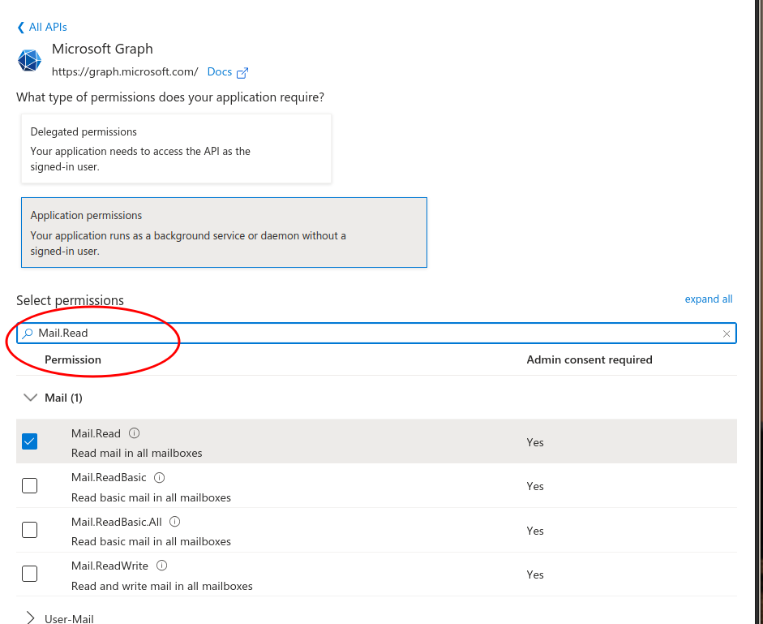

Når alle permissions er fundet og tilføjet skal det se ud som på billedet herunder:

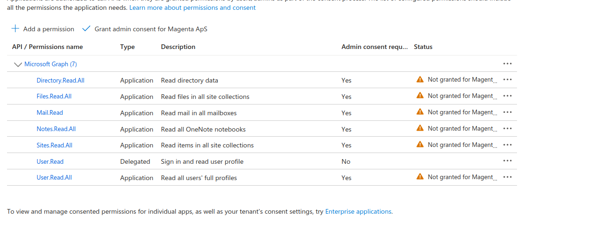

Disse tilladelser skal gives "admin consent", for din organisation, dette gøres ved at trykke på
"Grant admin consent for ..":

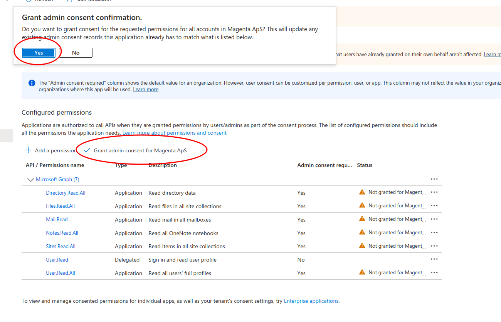

Dette bør lede dig tilbage til følgende, hvor du nu kan se, at tilladelsen er givet:

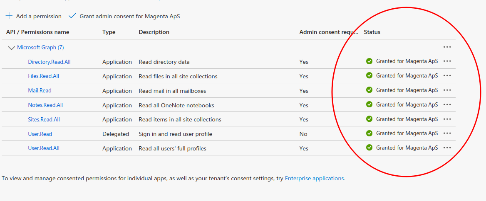

## Del 2: Oprettelse GraphGrant (Bevilling)

*Step 1*: Navigér til OSdatascanner's admin modul og find fanen "Bevillinger" i venstre menu:

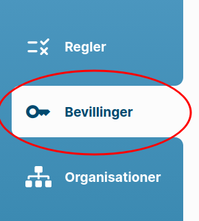

*Step 2:* Hold musen over knappen "Opret ny bevilling" og vælg MSGraph Bevilling

Her skal du bruge de noterede værdier fra del 1, til at udfylde følgende formular:

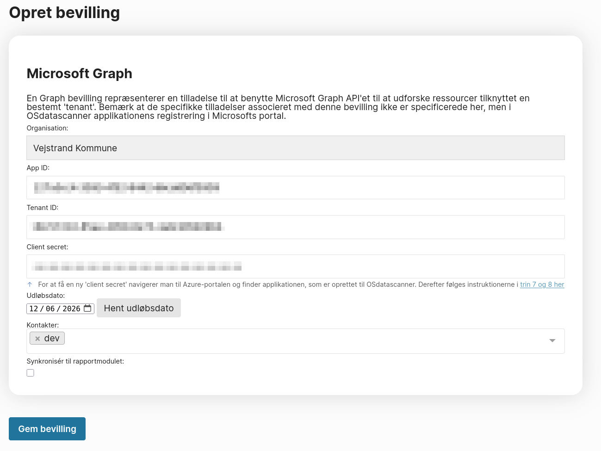

Du kan evt. trykke "Hent udløbsdato" og tildele en til flere personer under "Kontakter".
Dette vil sende en påmindelse pr. mail en uge før udløb af indtastede `Client secret`. 

Det er vigtigt at denne opdateres i tide, da scannerjob ellers vil miste deres rettigheder.

Tryk nu "Gem", og du vil nu have denne bevilling til rådighed under O365 scannerjob oprettelse.