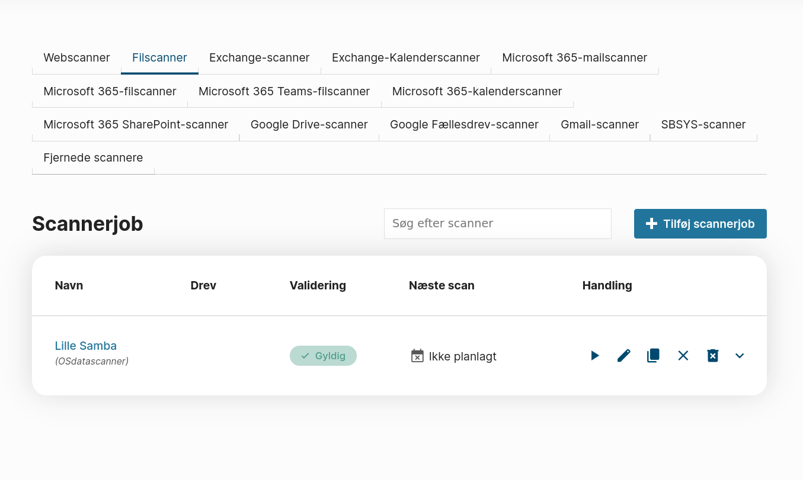
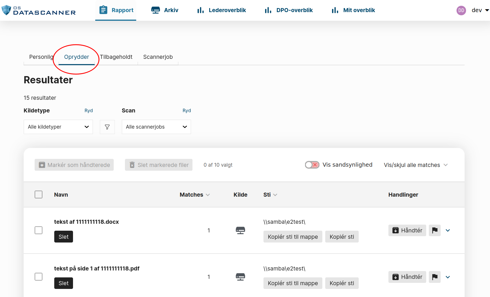

## Clone the Repo and Get Going!

To get a development environment to run, follow these steps:

1.  Clone the repo and start the containers:

         git clone git@git.magenta.dk:os2datascanner/os2datascanner.git
         cd os2datascanner
         source build_env.sh # exports git variables for build arguments (not required)
         docker compose pull # pre-fetches images to avoid building locally
         docker compose up -d

    You can now reach the following services on their respective ports:

    - Administration module: http://localhost:8020
    - Report module: http://localhost:8040
    - Web interface for message queues: http://localhost:8030 
    
    **OBS:** You may encounter permission issues, for that, check out [this section](missing-permissions.md)

2. Create users

    Run the `quickstart_dev` command for both the `admin` and `report` services. This command creates a superuser (`dev`/`dev`), a client, an organization, and other necessary baseline objects.
    
    **OBS:** Due to how the admin and report module function together, it is important you run the command against `admin` first.
    The admin module is the authoritative source and will synchronize an `Account` and `Organization`.

         docker compose exec admin django-admin quickstart_dev
         docker compose exec report django-admin quickstart_dev

3.  Start a scan:

     - Log into the administration module with the newly created superuser at
        http://localhost:8020  

     - Go to "Filescans" at http://localhost:8020/filescanners/
       You should now see a scan created for you, named "Lille Samba":
       

     - Start the scan by clicking the play button and confirming your choice.

4.  Follow the engine activity in RabbitMQ (optional):

    Credentials for the message queue web interface can be found in
    here in `dev-environment/rabbitmq.env`.

    1.  Log into the web interface for RabbitMQ at http://localhost:8030
    2.  Queue activity is available on the `Queues` tab.

5.  See the results:

    Log into the report module with the newly created superuser at http://localhost:8040
    The results from your scan, will go to your superuser as "remediator", navigate to that tab here:

     
    

## Quickstart Commands for Extra Test Data

To quickly populate your development environment with test data, you can use the provided `quickstart` management commands. Here is the recommended flow:

### 1. Start the Project with the LDAP Profile

For testing organizational imports, you need to start the OpenLDAP server. Use the `--profile ldap` flag with `docker compose`:

```sh
docker compose --profile ldap up -d
```

This starts all the standard services and additionally runs the OpenLDAP service. The LDAP server is automatically prepopulated with data from `dev-environment/openldap/01-corporation.ldif`. 
This file sets up a sample corporation with a hierarchical structure, including:
- A top-level "Organization"
- **113** Organizational Units (OUs) across 5 regions (e.g., NorthAmerica, Europe)
- A total of **501** user objects distributed throughout the hierarchy. (When importing, you'll have 502, because of "dev")

### 2. Set Up the LDAP Import Job

Now, run the `quickstart_import_job` command. This command configures the connection between OSdatascanner and the running OpenLDAP service.

```sh
docker compose exec admin django-admin quickstart_import_job
```

This will:
- Enable the necessary import features on the default client.
- Create an `LDAPConfig` object for the default organization, pointing to the test LDAP server (`ldap-server:389`).
- Configure the connection in the external Keycloak service, making the import job ready to run.

You can now navigate to the "Organizations" page in the admin UI (`http://localhost:8020/organizations/`) and start the import.

### 3. Generate Test Scan Results

Finally, to populate the report module with scan results, use the `quickstart_test_data` command.

```sh
# Generate 1000 reports for the universal remediator
docker compose exec report django-admin quickstart_test_data 1000

# Or, generate 50 reports for a specific, existing user
docker compose exec report django-admin quickstart_test_data 50 --username someuser
```

This command is optimized to generate a large number of `DocumentReport` objects quickly.

