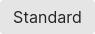
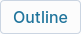
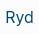
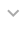
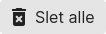
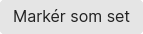
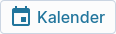
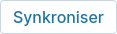

# Button Guide

Here you can find a guide on how to construct a button for OSdatascanner anno Jan'24.

## When to use `<button>` VS. `<a>`

- Use `<button>` when the button should:
    - Submit a form.
    - Trigger one or more JavaScript functions.
    - Toggle or interact with objects on the same page (e.g., open a modal or a dropdown menu).
- Use `<a>` when the button should:
    - Serve as a navigation UI to another page.
    - Link to a different place on the same page.
    - Start a download or link to files (e.g., PDFs).

***

> A good rule of thumb for using `<a>` tags for UI objects: 
> 
> Is it a link to anything? > No? > Use `<button>` instead.

***

## Required attributes

| HTML Tag      | Attribute     | Reason                                                                                    |
| :-----------: | :-----------: | ----------------------------------------------------------------------------------------- |
| *any*         | `class`       | Styling - All buttons should have at least the `button` class.                            |
| *any*         | `aria-label`  | Accessibility - This text is read aloud by screenreaders.                                 |
| *any*         | `title`       | Toolhint - Displays on hover to elaborate on function.                                    |
| `<button>`    | `type`        | Functionality - Defines button behavior in forms and prevents unintended <br> actions.    |
| `<a>`         | `href`        | Navigation - Specifies the destination URL for the link.                                  |


### Semantic structure

To ensure all required attributes are included, list them first. 
This is especially helpful for those less familiar with your code, as it prioritizes the element's purpose (type/href).

``` html
<button type="button"
        class="button button--outline-button button--icon-text-button"
        aria-label="descriptive text that makes sense for a user with visual impairment"
        title="text that elaborates on function (i.e. toolhint)"
        <!-- other attributes -->
        >
    <span>your button text</span>
    <i id="icon_name" class="material-icons">icon_name</i>
</button>
``` 

``` html
<a href="../relative_path/to_whereever/this_should/link_to/"
   class="button button--outline-button button--icon-text-button"
   aria-label="descriptive text that makes sense for a user with visual impairment"
   title="text that elaborates on function (i.e. toolhint)"
   <!-- other attributes -->
   >
    <span>your button text</span>
    <i id="icon_name" class="material-icons">icon_name</i>
</a>
``` 

These blocks render identically in a browser; the only difference is their functionality.

Additionally, wrapping text strings with `<span>` tags or similar is considered good practice: 

> It is benificial for targeted styling and JavaScript interaction, improving accessibility by allowing screen readers to interpret text more effectively, and ensuring maintainability and modularity in web development.
>
> This practice enables precise styling adjustments and script interactions for specific text segments without affecting the entire element, thereby enhancing both the functionality and the accessibility of web content.

***

## Button styling - a developer guide

All button style classes follow the [BEM] [1] (Block, Element, Modifier) naming convention for easy identification and navigation within unfamiliar code.

### Intro to `_buttons.SCSS`

The document accommodates all current styling types used in OSdatascanner. It includes content-based style classes (*like icon, icon+text, and text*) which handle box-model related styles e.g., for buttons nested inside table cells.

#### Button design reference

The table below serves as a quick reference guide for UI development when working without a mock-up, providing key insights on button types, their visual weight, and appropriate use cases.

| Design Label  | Type          | Visual weight | Use case                                                                                                                                          |
| ------------- | ------------- | ------------- | ------------------------------------------------------------------------------------------------------------------------------------------------- |
| *N/A*         | Standard      | Moderate/low  | Neutral - For actions, that are neither urgent <br> nor secondary.                                                                                |
| Primary       | CTA           | High          | "Call to Action" - Draws attention and prompts <br> user to take an important action.                                                             |
| Secondary     | Outline       | Moderate      | For less prominent actions, that are secondary <br> but still necessary.                                                                          |
| *N/A*         | Transparent   | Low           | When the button needs to blend with the <br> background or for a minimalistic design approach.                                                    |
| *N/A*         | Rounded       | Variable      | For a friendly and approachable interface. <br> Suitable for both primary and secondary actions, <br> depending on size, color, and placement.    |

#### Class list

Here's an overview of class combinations and their use cases:

| UI Appearance                                             | Type                          | Classes                                                                                                                           |
| --------------------------------------------------------- | ----------------------------- | --------------------------------------------------------------------------------------------------------------------------------- |
|              | Standard                      | `button`                                                                                                                          |
|                        | CTA                           | `button` `button--cta-button`                                                                                                     |
|               | Outline                       | `button` `button--outline-button`                                                                                                 |
|        | Transparent                   | `button` `button--transparent-button`                                                                                             |
|     | Caret/expand | `button` `button--caret-button` <br> ` up ` |
|                | Rounded                       | `button` `button--rounded-button`                                                                                                 |
|     | Standard &#124; Icon          | `button` `button--icon-button`                                                            |
|    | Standard &#124; Icon+text     | `button` `button--icon-text-button`                                                                                               |
|              | Standard &#124; Text          | `button` `button--text-button`                                                                                                    |
|            | cta &#124; Icon+text          | `button` `button--cta-button` <br> `button--icon-text-button`                                                                     |
|      | Outline &#124; Icon           | `button` `button--outline-button` <br> `button--icon-button`                                                                      |
|    | Outline &#124; Icon+text      | `button` `button--outline-button` <br> `button--icon-text-button`                                                                 |
|       | Outline &#124; Text           | `button` `button--outline-button` <br> `button--text-button`                                                                      |

### Multiple buttons in same UI block

Place them inside a `<div>` container (if they're not already) and give it the class `button-group` like so:

``` html
<div class="button-group other_class">
    <a href="#action1"
       class="button button--icon-button"
       aria-label="descriptive text"
       title="toolhint"
       <!-- other attributes -->
       >
        <i id="icon_name" class="material-icons">icon_name</i>
    </a>
    <button type="button"
            class="button button--icon-button"
            aria-label="descriptive text"
            title="toolhint"
            <!-- other attributes -->
            >
        <i id="icon_name" class="material-icons">icon_name</i>
    </button>

    <!-- Additional buttons can be added similarly -->

</div>
```


This arrangement handles the relative layout of multiple button-related objects and suits most use cases for button groups in OSdatascanner.

<!-- LINKS -->
[1]: https://css-tricks.com/using-sass-control-scope-bem-naming/ "A guide to using BEM with SCSS"