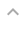

# Buttons

Here you can find a guide on how to construct a button for DataScanner anno Jan'24.

## When to use `<button>` VS. `<a>`

- Use `<button>` when the button should:
    - Submit a form
    - Trigger one or more JavaScript functions
    - Toggle/interact with elements on the same page (ie. open a modal or a dropdown menu)
- Use `<a>` when the button should:
    - Work as navigation-UI to another page
    - Link to a different place on the same page
    - Start a download or link to files ie. PDFs

``` html
A good rule of thumb for using <a> tags for UI elements: 

                    Is it a link to anything? > No? > Use <button> instead.
```

***

## Required attributes

| HTML Tag      | Attribute     | Reason                                                                            |
| :-----------: | :-----------: | --------------------------------------------------------------------------------- |
| *any*         | `class`       | Styling - All buttons need to at least have the `.button` class                   |
| *any*         | `aria-label`  | Accessibility - This is the text a screenreader would read out loud               |
| *any*         | `title`       | Toolhint - This is what will be displayed on hover                                |
| `<button>`    | `type`        | Functionality - Defines button behavior in forms + prevents unintended actions    |
| `<a>`         | `href`        | Navigation - Specifies the link's destination URL                                 |


### Semantic structure - *good habits*

To avoid forgetting any of the required attributes, it's a good habit to write them first. 
It's easier for people who aren't experts on your amazing code if the *purpose* is the first thing listed (*type/href*).

Besides this, it's a good habit to envelop button text strings with `<span>` tags or similar. 

``` html
<button type="button"
        class="button button--outline-button button--icon-text-button"
        aria-label="decsriptive text that makes sense for a user with visual impairment"
        title="text that elaborates on function (i.e. toolhint)"
        <!-- other attributes -->
        >
    <span>your button text</span>
    <i id="icon_name" class="material-icons">icon_name</i>
</button>
``` 

``` html
<a href="../relative_path/to_whereever/this_should/link_to/"
   class="button button--outline-button button--icon-text-button"
   aria-label="decsriptive text that makes sense for a user with visual impairment"
   title="text that elaborates on function (i.e. toolhint)"
   <!-- other attributes -->
   >
    <span>your button text</span>
    <i id="icon_name" class="material-icons">icon_name</i>
</a>
``` 

Both of these blocks would be rendered *exactly* the same way in a browser- the only difference is funtionality.

---


## Button styling - a developer guide

All button related style classes have been constructed with the naming convention [BEM] [1] as foundation. The class are descriptive (*the degree of description could be considered overkill by some*) and should make it easy to identify, when navigating unfamiliar code. 

### Intro to `_buttons.SCSS`

The document is layed out so it accomodates all types of styling that we currently use in DataScanner. We primarily use

There are a few content-bases style classes, (*icon, icon+text, and text*) that handles box-model related styles i.e. for buttons nested inside table cells.

You can see what class combinations to use when in the overview below. 

### Class list

| UI Appearance                                                                                                         | Type                          | Classes                                                           |
| --------------------------------------------------------------------------------------------------------------------- | ----------------------------- | ----------------------------------------------------------------- |
|                                                               | Standard                      | `.button`                                                         |
|                                                                         | CTA                           | `.button` `.button--cta-button`                                   |
|                                                                | Outline                       | `.button` `.button--outline-button`                               |
|                                                         | Transparent                   | `.button` `.button--transparent-button`                           |
|                                                                     | Caret                         | `.button` `.button--caret-button`                                 |
|                                                                 | Rounded                       | `.button` `.button--rounded-button`                               |
|   | Standard &#124; Icon          | `.button` `.button--icon-button`                                  |
|                                                | Standard &#124; Icon+text     | `.button` `.button--icon-text-button`                             |
|                                                              | Standard &#124; Text          | `.button` `.button--text-button`                                  |
|                                                        | cta &#124; Icon+text          | `.button` `.button--cta-button` `.button--icon-text-button`       |
|                                                       | Outline &#124; Icon           | `.button` `.button--outline-button` `.button--icon-button`        |
|                                                | Outline &#124; Icon+text      | `.button` `.button--outline-button` `.button--icon-text-button`   |
|                                                       | Outline &#124; Text           | `.button` `.button--outline-button` `.button--text-button`        |

### Multiple buttons in same UI block

Place them inside a `<div>` container and give it the class `.button-group`.

``` SCSS
.button-group {
  display: flex;
  align-items: center;
  flex-wrap: wrap;
  gap: 0.5rem;
}
```

This handles relative layout between n-amount of button related elements inside of it and will match most usecases for button groups in DataScanner.

<!-- LINKS -->
[1]: https://css-tricks.com/using-sass-control-scope-bem-naming/ "A guide to using BEM with SCSS"