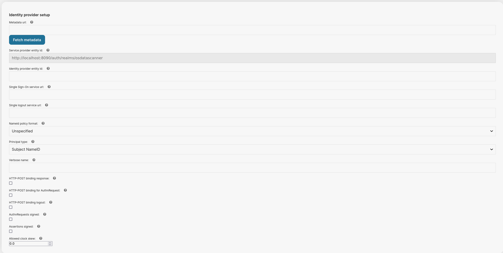
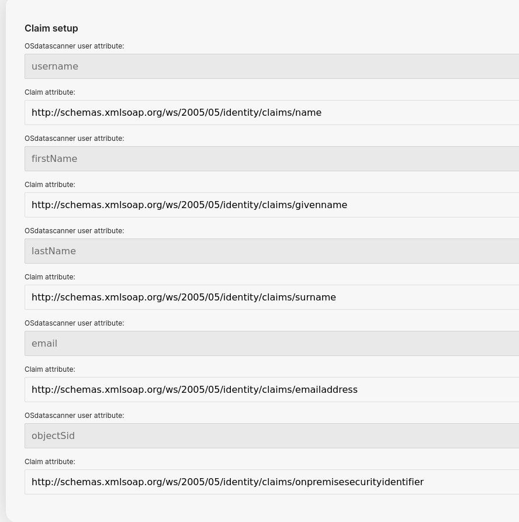

# Single Sign-On


Currently, the report module of OSdatascanner supports the use of Single Sign-On, through the
use of Keycloak.

Technically speaking, OSdatascanner is able to communicate with Keycloak through the OIDC-protocol,
and Keycloak is able to communicate with your desired IdP through the SAML protocol.

Hence, if you desire to configure SAML based Single Sign-On (which you'll want to most of the time),
you must have a running Keycloak instance configured as well.


**Be aware that many of these settings depend on knowing the Keycloak realm id/name. **

This realm is created by OSdatascanner and is by default set to the OSdatascanner Organization
slug. 

** So, you must know the Organization slug value before configuring. **

## Important OSdatascanner configuration


### Admin settings
```yaml
KEYCLOAK_ENABLED = true
OIDC_CREATE_USER = false

# [keycloak]
KEYCLOAK_BASE_URL = ""
KEYCLOAK_ADMIN_CLIENT = ""
KEYCLOAK_ADMIN_SECRET = ""
# It's important that this corresponds to the same value in the report module!
OIDC_RP_CLIENT_ID = ""

```

* **KEYCLOAK_ENABLED**

  Technically doesn't do _anything_ in the admin module, but is used as a "feature flag" and
  should be equal to report module setting.


* **OIDC_CREATE_USER**

  Technically doesn't do _anything_ in the admin module, but is used as a "feature flag" and
  should be equal to report module setting.


* **KEYCLOAK_BASE_URL** 

    Must point to the domain where Keycloak is running.

* **KEYCLOAK_ADMIN_CLIENT**

    Identifier of an "admin" client in Keycloak. Used to manage Keycloak.

* **KEYCLOAK_ADMIN_SECRET**

    Secret value of the above client, to use for authentication when managing Keycloak.

* **OIDC_RP_CLIENT_ID**

    Name of the OIDC client in Keycloak that OSdatascanner is to use.
    This client represents OSdatascanner.
    It is important that this is the same as in Report.

### Report settings

```yaml
KEYCLOAK_ENABLED = true
# Client info from keycloak
OIDC_RP_CLIENT_ID = ""
OIDC_RP_CLIENT_SECRET = ""
# user creation
# Say no to automatic user creation by default; we tend to use import jobs.
OIDC_CREATE_USER = false

OIDC_OP_AUTHORIZATION_ENDPOINT = ""
OIDC_OP_TOKEN_ENDPOINT = ""
OIDC_OP_USER_ENDPOINT = ""
# signing algorithm and key
OIDC_OP_JWKS_ENDPOINT = ""
# login and logout urls
LOGOUT_URL = ""
```

* **KEYCLOAK_ENABLED**

    Tells OSdatascanner that Keycloak is enabled and activates needed OIDC url patterns.

* **OIDC_RP_CLIENT_ID**

    Name of the OIDC client in Keycloak that OSdatascanner is to use.
    This client represents OSdatascanner.
    It is important that this is the same as in Admin.

  * **OIDC_RP_CLIENT_SECRET**

    Setting needs to be present otherwise the OIDC package will fail,
    but we currently don't need an actual value.

* **OIDC_CREATE_USER**

    Determines whether the OIDC log-in flow can create new users or not.
    In cases where OSdatascanner utilizes organizational import jobs, this should be set `false` to
    avoid database conflicts. Dependant on your type of import job, Keycloak or OSdatascanner will
    then determine if there is an existing user or not.

* **OIDC_OP_AUTHORIZATION_ENDPOINT**

    OIDC authorization endpoint for the customer's Keycloak realm.

* **OIDC_OP_TOKEN_ENDPOINT**

    OIDC token endpoint for the customer's Keycloak realm.

* **OIDC_OP_USER_ENDPOINT**

    OIDC userinfo endpoint for the customer's Keycloak realm.

* **OIDC_OP_JWKS_ENDPOINT**

    OIDC jwks endpoint for the customer's Keycloak realm. (The URL ending with /certs)

* **LOGOUT_URL**

    OIDC logout endpoint for the customer's Keycloak realm.


## Identity Provider required values from OSdatascanner

When you're configuring your Identity Provider, you'll probably need two values from OSdatascanner:

1. An identifier / Entity ID
2. A reply / Assertion Consumer Service URL (ACS for short)

Because Keycloak is used as "middleman", these URL's won't actually be pointing directly to 
OSdatascanner, but to Keycloak.

In the next step, you'll be able to copy the pre-filled "Service provider entity id", which
is your identifier / entity id.

It'll be structured like: `http(s)://<KEYCLOAK_HOSTNAME>/auth/realms/<REALM NAME>`

Your ACS url will by default be: 
`http(s)://<KEYCLOAK_HOSTNAME>/auth/realms/<REALM NAME>/broker/SAML-SSO/endpoint`

OSdatascanner will automatically create a Keycloak realm and an identity provider named "SAML-SSO"
when you're configuring Single Sign-On in OSdatascanner.

This should be all you need to create your Enterprise Application with Single Sign-On if using Azure,
or your "relying party trust" if you're configuring through ADFS.

## Configuring Single Sign-On in OSdatascanner

The IdP specific configuration of Single Sign-On is made through the admin module.

However, before you're able to do so, it is important that you're aware of what kind of setup is
right, for the given customer environment.

Usually, if you wish to use Single Sign-On, you'll want one of two setups:

1. An import job and `OIDC_CREATE_USER = FALSE`
2. No import job and `OIDC_CREATE_USER = TRUE`

That means that the `Client` either must have an import feature enabled, or be allowed to
create new users.

(In both scenarios `KEYCLOAK_ENABLED = TRUE` is also a prerequisite.)

You won't be able to access the configuration page if these prerequisites aren't made, as
it isn't clear what kind of setup you're trying to achieve.

The reasoning behind disallowing user creation when using an import job, is to avoid database
conflicts. The import job serves as the source of truth, and users should
only be allowed access if they already exist in OSdatascanner.

On the contrary, if you're not importing your user data, the system must be able to create
OSdatascanner users upon login, otherwise the report module will be inaccessible.


With that said, navigate to the admin module's "Organizations" tab and press the "key" icon found
under the "Actions" column for your organization.

That should, if your system is configured correctly, take you to a page that looks like the 
following, and has "Service provider entity id" pre-filled:



It is now your job to fill in the correct information from desired Identity Provider.

If the Identity Provider supports it, you can provide a URL to its public metadata in xml format.
Press "Fetch metadata" and OSdatascanner will try to prepopulate the configuration for you.

Scrolling down the page, you'll lastly want to set up claims.

An example of how that may look like:



The greyed out fields are attribute names to be used by OSdatascanner. In actuality, they're
Keycloak user attributes, but it is crucial these are not changed, as they will ultimately be
OSdatascanner user attributes.

The "Claim attribute" fields are the attribute names to be found in the SAML assertion.

These claims will be set up using the "basic" attribute format, which means a simple string format.

If you're using Azure as your IdP, it's common that these claims will be under the namespace:
"http://schemas.xmlsoap.org/ws/2005/05/identity/claims/..."

However, this is not a requirement and _can_ be changed in Azure, but be sure to include
the full string if that is the case.