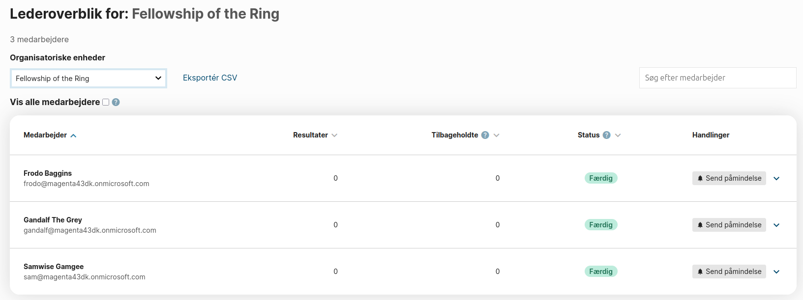
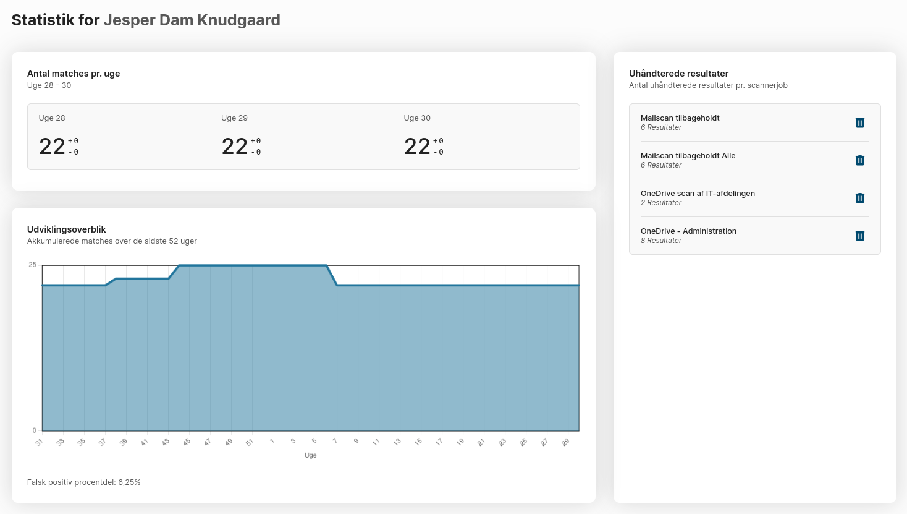
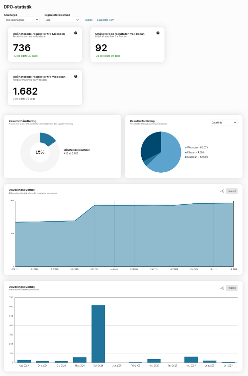
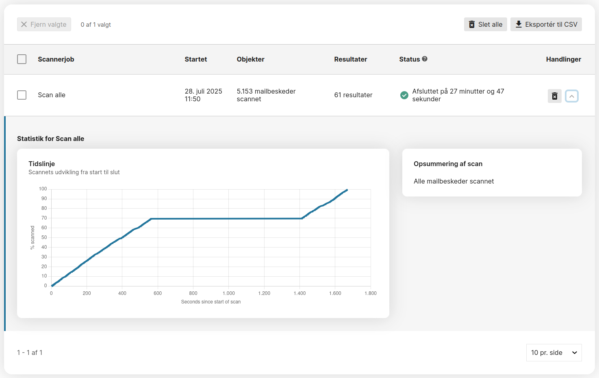

# Statistics

Different statistics pages are shown in different parts of OSdatascanner. The way statistics are queried, and the way they are presented, differ a lot.

## Leader overview

In the leader overview, managers can get an overview of the employees they either directly manage, or manage through their managed organizational units.

By default, only managed organizational units are shown, but this can be configured on the Organization object in the admin module.

The overview shows a table listing the relevant employees, as well as the following information:

* Name and username of the employee
* Number of unhandled results for each employee
* Number of unhandled results older than the defined retention policy (optional -- controlled through the Organization object)
* Number of unhandled withheld results for each employee
* The status of each employee, ranging from "Not Accepted" through "Accepted" to "Done"
* Hyperlink to each employee's mail address
* An extended overview of statistics specific to the employee. Contains the exact information described in the [User overview](#user-overview) section.

### Number of unhandled results

This number is calculated using the `AccountQueryset.with_unhandled_matches` method. This method counts all results related to the account through aliases with the following conditions:

* The alias relating the report to the account is _not_ a remediator alias.
* The alias relating the report to the account is _not_ marked as a shared alias.
* The report contains at least one match, as checked on the `number_of_matches` field
* The resolution status of the report is `None` (unresolved)
* The report is _not_ withheld, as checked on the `only_notify_superadmin` field
* The report belongs to the same organization as the account

### Number of unhandled results older than the retention policy allows

This number is calculated using the `AccountQuerySet.with_old_matches` method. This method counts all results related to the account through aliases with the following conditions:

* All of the same conditions specified for [unhandled results](#number-of-unhandled-results).
* The `last_modified` date of the scanned source is further in the past than the retention policy age defined on the Organization object.

### Number of unhandled withheld results

This number is calculated using the `AccountQuerySet.with_withheld_matches` method. This method counts all results related to the account through aliases with the following conditions:

* The alias relating the report to the account is _not_ a remediator alias.
* The alias relating the report to the account is _not_ marked as a shared alias.
* The report contains at least one match, as checked on the `number_of_matches` field
* The resolution status of the report is `None` (unresolved)
* The report is withheld, as checked on the `only_notify_superadmin` field
* The report belongs to the same organization as the account

### Employee status

The status of the employee indicates whether the employee is done handling results, is actively handling results but is not done, or is not actively handling results. The status shown on the table comes from the `Account.match_status` method.

The method calculates the number of new matches received within three weeks and the number of matches handled within three weeks. Then, the status is returned. The three statuses "completed", "accepted", and "not accepted" mean the following:

#### Completed

The employee has zero unhandled results in total. There is nothing left to do.

#### Accepted

The employee still has some unhandles results, but have handled a number of results during the last 3 weeks. The number of results handled is at least equal to 75% or more of the number of new results received during the last 3 weeks.

#### Not accepted

The employee still has som unhandled results, and have either not handled any results, or not handled enough, during the last three weeks. The employee has handled less than 75% of the number of new results received during the last 3 weeks.

### Notification button

Each table row has a button for notifying an employee. This button is simply a hyperlink to the employee's email address.
It is intended design that OSdatascanner does not populate the email with any information, or in any way automatically notifies the user. Users are already notified whenever they have unhandled results.
The intended use is for the manager to contact the employee in a helpful and engaging way, and this cannot be achieved in an automatic way.

## User overview

In the user overview, in the UI accessed via the navigation button "My overview", each user can get some statistics related to their own results, and the change in their own results.

The overview consists of 2-3 cards, each containing the following information:

* The number of total unhandled results at the end of each of the last three weeks, including the number of new results received during each of the last three weeks, as well as the number of results which have been handled during each of the last three weeks.
  The number of new results received during each of the weeks are shown to the right and above the number of total unhandled results for that week, and is lead by a "+".
  The number of results handled during each of the weeks are shown to the right and below the number of total unhandled results for that week, and is lead by a "-".

* A graph of the number of total unhandled results at the end of each week during the last year. Below the graph, the _false positive rate_ is displayed. The _false positive rate_ is the number of results handled as a false positive divided by the total number of handled results. The number is displayed as a percentage.

* A list of scanners from which the user has received one or more results. Each entry in the list contains the scanner name, the number of results stemming from that scanner, and a button for deleting all results stemming from that scanner related to the user. This card is only visible if the user has permission to delete `DocumentReport` objects.

## DPO overview

The DPO overview provides valuable insight across the entire organization. The page can be accessed by `Account`s related to an `OrganizationalUnit` through a `Position` with the "data protection officer" role.

By default, the information on this page is for the entire organization, but it is possible to filter by scanner job and/or by organizational unit.

The overview consists of:

* A card for each type of scanner which has produced results, indicating how many unhandled results remain from each source, as well as the change of the total number of unhandled results during the last 30 days.

* A doughnut diagram indicating the total number of results (handled or unhandled) and the total number of handled results filled in. The center of the doughnut displays the percentage of results which have been handled.

* A pie chart indicating the distribution of results from different sources, i. e. types of scanners (web scan, file scan, mail scan etc.).

* A pie chart indication the distribution of resolution statuses on handled results ("deleted", "false positive" etc.). This chart can be accessed through the dropdown close to the previously mentioned pie chart.

* A line chart indicating the accumulating unhandled results per month during the past year. The chart shows the total number of results, which were still unhandled at the end of the month. The chart can be zoomed along the x-axis.

* A bar chart indicating the number of new matches received in each month during the past year. The chart can be zoomed along the y-axis.

## Completed scans

In the admin module on the "scanner status" tab on the "completed scans" subtab, information about previously run scans can be seen.
The page consists of a table where each table row corresponds to a previously run scan. Each row contains the following information:

* The name of the scanner.
* The time at which the scan started. For manually started scans, this indicates the time at which the user started the scan. For scheduled scans, this indicated the time at which the automatic execution of the scan triggered.
* The number of objects scanned during the scan. "Objects" is a bit of a fluffy concept. For a mail scan, it's fair to assume that each mail is an object. But each attached file is also an object. If any attached file is a container-like file (such as a pdf), every member of the container is also an object (such as a page of a pdf).
* The number of results found during the scan. This number is the total number of results found during the scan, _not_ the number of _new matches_ compared to previous scans. Scanners retain no knowledge of previous scans, except when they were run.
  In a case where some results from a scan have been marked as "false positives" in the report module, they will still show up as results in this overview, because the scanner has no knowledge about the state of the report module.
* The status of the scan. For completed scans, this will indicate the total runtime of the scan. For cancelled scans, this field will indicate that the scan was cancelled.
* Additional information can be accessed by pressing the caret to the far right of the table row:
    * A timeline for the number of scanned objects as a function of time elapsed.
    * A scan summary, indicating how many objects were skipped due to no change, and how many new objects were discovered during exploration.

